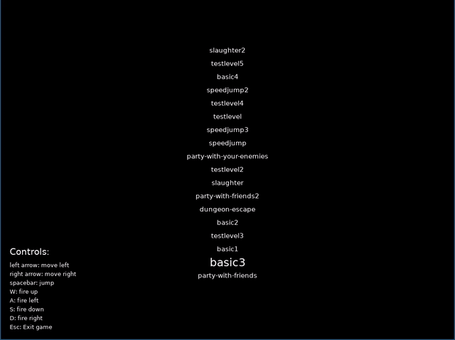

# Black-n-white
Python 2D adventure game implemented from scratch using Pygame.

The objective is to get to the finish and kill some enemies along the way.

## Setup
```
$ pip install -r requirements.txt
```

### Running the game
```
$ python game.py
```


## Levels
Levels are stored in `levels` directory in a simple text format.
To add new level, create the level text file in the specified format and put it into `levels` directory. It will be automatically loaded.


### Format spec
- `P` - Player
- `X` - Wall
- `L` - Extra Life
- `^`, `>`, `V`, `<` - spikes
- `S` - Enemy sprite
- `F` - Finish

### levels/basic3
```

X
X
X                                                    XXX
X                                                    ^ vF
X                    ^                             XXXXXXXX
X                 ^ XX                            X
X  L L P         <XXXXX   S  ^    ^^^ S    S    X
XXXXXXXXXXXXXXXXXXXXXXXXXXXXXXXXXXXXXXXXXXXXXXXXX

```


## Gameplays
### Level `basic3`


### Level `dungeon-escape`


